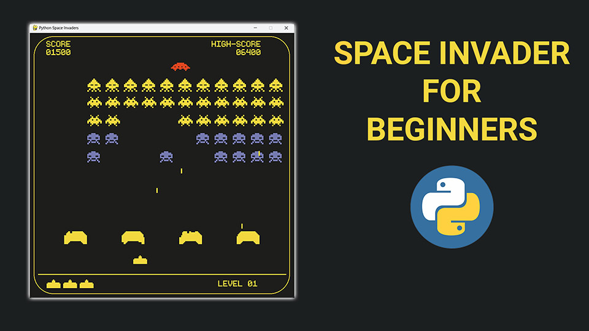

# Space Invaders Game

🚀🕹️🐍 Space Invaders is a classic arcade game where the player controls a spaceship that moves horizontally at the bottom of the screen and shoots bullets to destroy incoming enemies. The game gets more challenging as the player progresses.

# Screenshot
<p align="center">
  
</p>

## Table of Contents

- [Description](#description)
- [Screenshots](#screenshots)
- [Features](#features)
- [Requirements](#requirements)
- [Installation](#installation)
- [Usage](#usage)
- [Game Controls](#game-controls)
- [License](#license)

## Features

- Player can move left and right
- Player can shoot bullets
- Enemies move and descend towards the player
- Collision detection between bullets and enemies
- Score tracking
- Game over condition when enemies reach the player

## Requirements

- Python 3.x
- Pygame library

## Installation

1. Ensure you have Python 3.x installed. You can download it from [python.org](https://www.python.org/).

2. Install Pygame using pip:
    ```bash
    pip install pygame
    ```

3. Clone this repository or download the code:
    ```bash
    git clone https://github.com/VadymMakohon/Space_Invaders.git
    cd space-invaders
    ```

4. Place the required images (player.png, enemy.png, bullet.png, and optionally ufo.png) in the same directory as the Python script.

## Usage
Run the `space_invaders.py` script to start the game:
    ```bash
    python space_invaders.py

## Game Controls
- Left Arrow Key: Move the player to the left
- Right Arrow Key: Move the player to the right
- Spacebar: Shoot bullets

## 📜 License

This repository is for educational purposes only and has an MIT License

### Show your support

Give a ⭐ if you like these projects!

# Contributors
- [Vadym Makohon](https://github.com/VadymMakohon)
